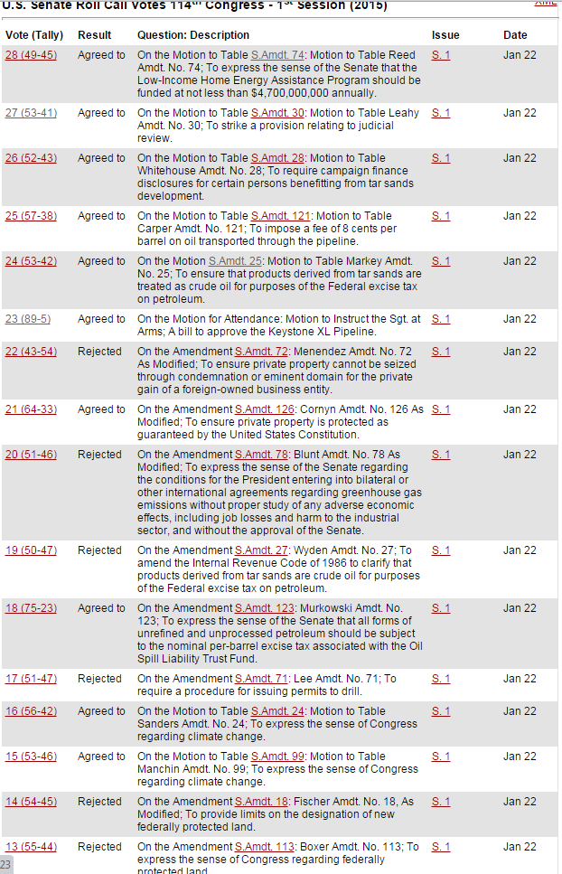

A few days ago, I [mentioned](/archive/context-on-sanders-amendment/) that Senate Republicans were going to "consider" a bunch of amendments to the Keystone pipeline bill offered by Senate Democrats. Well, last night was the night they were "considered."

Here's a screenshot of the votes, and you can see the [actual votes here](http://www.senate.gov/legislative/LIS/roll_call_lists/vote_menu_114_1.htm) too, but guess what happened: hardly any of the amendments offered by Senate Democrats actually got a vote. Instead, Senate Republicans voted to table most of them, which effectively removed the amendments from consideration. That's not the same as filling the amendment tree to prevent minority members from offering amendments — a favored tactic of Harry Reid when he was Majority Leader — but it has the same result. For instance, we'll never know who would have voted against the Sanders amendment recognizing global warming as human-made.

In the original post, I argued that the responsible thing for Majority Leader McConnell to do for his party was to prevent votes on minority-offered amendments. I stand by that. McConnell took steps to protect his members from potentially embarrassing votes, which is among his primary duties as party leader. Whether he did the responsible thing policy-wise is a separate question.
