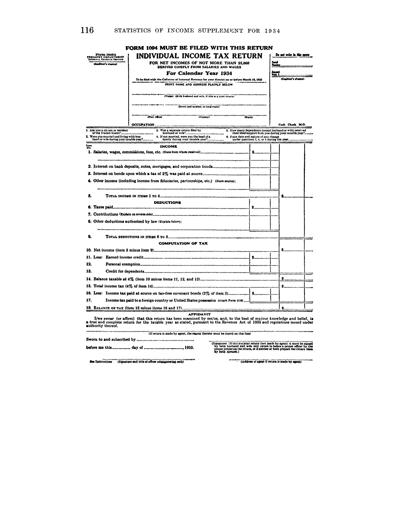
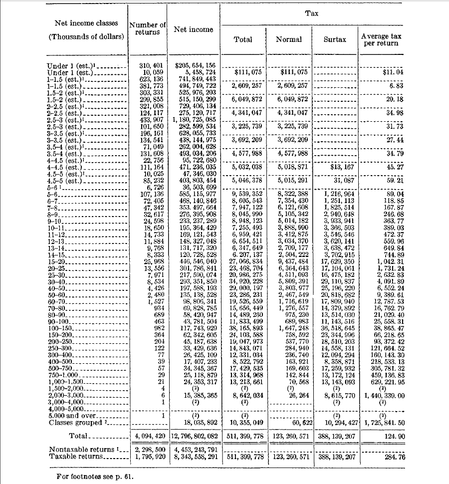

I've been looking through old IRS publications called ["Statistics of Income"](http://www.irs.gov/uac/SOI-Tax-Stats-Archive---1934-to-1999-Tax-Information-from-Individuals) in order to cull some data to incorporate into my dissertation, and there is a lot of cool stuff there. A motivated researcher could make an entire career with this data. Here is a summary of some of the good stuff, along with a couple of screenshots of cool pages.

The Statistics of Income data goes back to 1934 and has things like:

1. How many people paid income tax per tax bracket, and how much money each bracket accounted for.
2. How much money the government didn't collect because of tax credits, deductions, and exemptions.
3. How much tax was paid, aggregated by state and occasionally county.
4. How much tax was collected and how many returns were filed, based on filing classification (single, head of household, etc.).
5. Copies of tax forms for that year.

Here, for instance, is the income tax form for people who made under 5,000 dollars:

and the breakdown for that year:

All in all, the amount of information contained in these things is tremendous if you're interested in federal revenue at any level.
