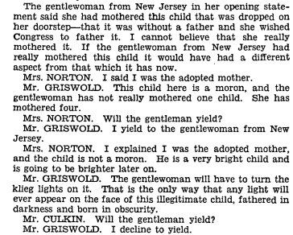

I've been working on revisions to one of my dissertation chapters, and I came across a chunk of the Congressional Record where a member of Congress extends an analogy offered by the bill's sponsor. The context: this debate is from 1938, when Congress was trying to enact the first federal minimum wage. The original House sponsor of the bill, House Labor Chairman William Connery, had died and was replaced by House Chairwoman Mary Norton. So Norton took over working on legislation that wasn't originally hers. I think the rest speaks for itself.

