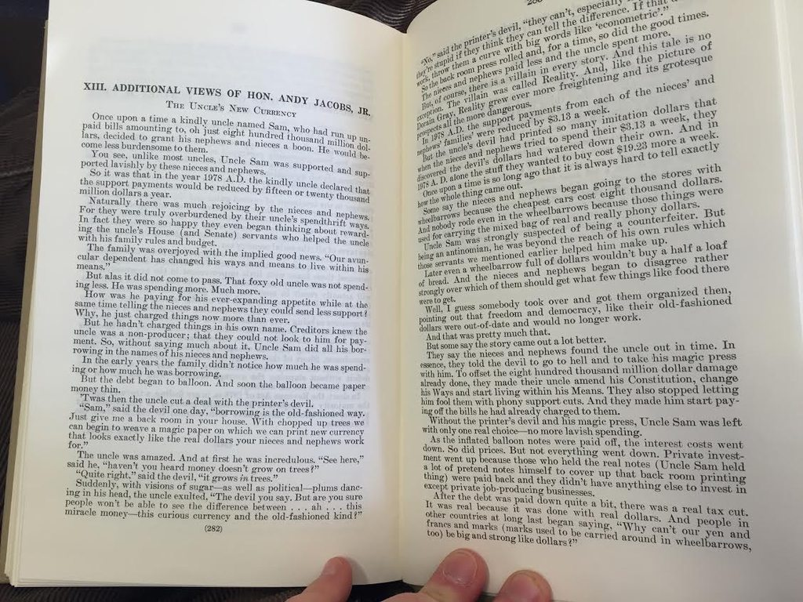
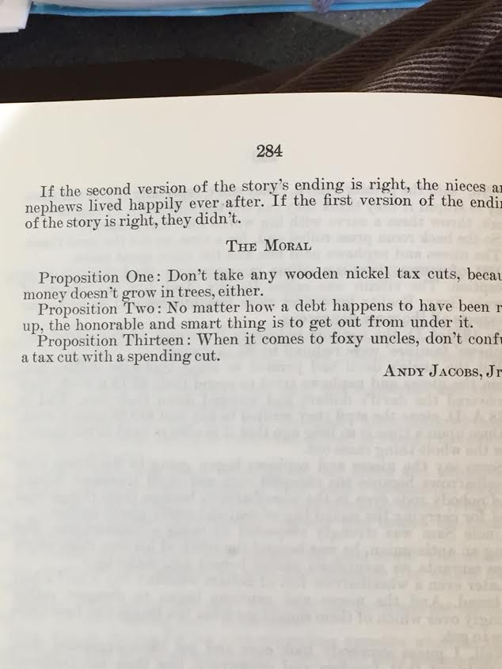

As part of my dissertation work, I've been looking through old committee reports about tax legislation. Usually these things include rationales for why they're making changes to existing law. If the legislation is especially important, committee reports also include dissenting views or additional commentary about it.

Attached to this post is some additional commentary on the Revenue Act of 1978, authored by Rep. Andy Jacobs (D-IN). By all accounts he was a good old-fashioned liberal, but in this case he felt the need to express his opinion about the legislation through the lens of Uncle Sam. I wonder how common this sort of thing is. I know former (and disgraced) Rep. Jim Traficant (D-OH) [used to say crazy stuff in his one-minute speeches](http://www.jim-traficant.com/minutearchive/1997minutspeeches.html), but this is a new level of dedication to the medium.

