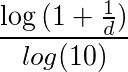
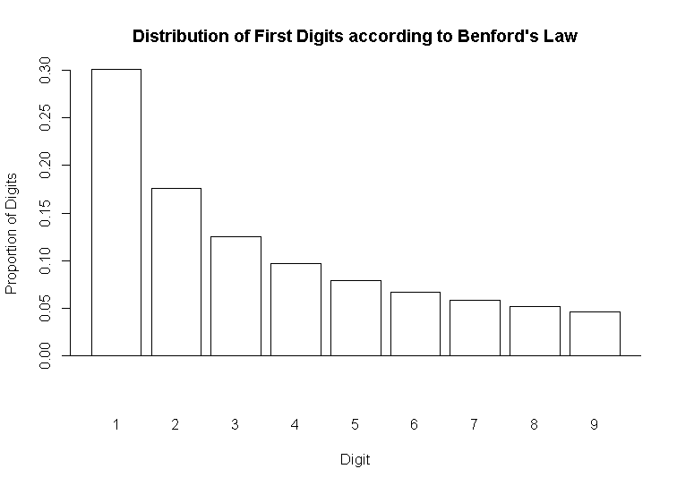
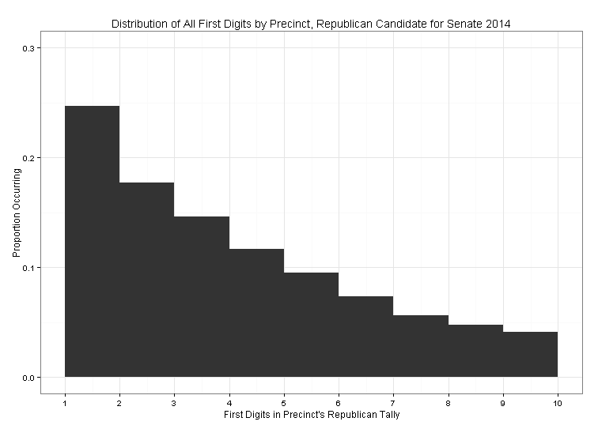

A couple of weeks ago at dinner with friends, I brought up how some social scientists think we can analyze the way digits are distributed to uncover election fraud, but I wasn't able to articulately explain it to my dinner companions. So I wrote up a quick thing to help show what I meant. In this post, I'll describe Benford's Law (which is what the natural distribution of digits is sometimes called), show it mathematically (don't worry, it's quick), show what it looks like graphically, and then do a quick analysis to see whether the 2012 Minnesota Senate election fits it.

Benford's Law, also called the first-digit law, states that in many naturally occurring collections of numbers, smaller digits occur disproportionately often as the leading digit than larger digits. In other words, one shows up more often as a first digit than nine does. Theoretically it can be applied to any digit position in a number, but practically most people use it to examine the first digit in a series of numbers. So if we have the numbers 132, 191, 323, and 434, we'd see one instance of three, two instances of one, and one instance of four as the first digit. Many types of numbers fall according to this pattern — house numbers in a city, monetary transactions for a business (which is why Benford's Law can be used to detect fraud), and occasionally election results. Mathematically, Benford's Law is usually described using base-ten logarithms.

And if we plot that equation, it looks like this:

To reiterate: if we collect all of the first digits in a series of numbers, sum them up, and calculate the percentage of first digits that each number represents, it should follow the pattern in that plot. More concretely, about thirty percent of first digits should be one, around seventeen percent should be two, and so on. (As an aside, this distribution is an example of a lognormal distribution — another thing that follows this type of distribution is city size: there are many more small cities than big ones.) The logic goes that if we collect a real series of numbers and the digits differ greatly from the theoretical prediction, something is probably amiss with the real-world data.

To illustrate this, I used Benford's Law to check whether the distribution of digits in a recent American election matches what's theoretically predicted. Specifically, I looked at whether the distribution of Republican votes in the 2012 Minnesota U.S. Senate race fits the expected distribution. I collected precinct-level results for that race from the Minnesota Secretary of State's website — 4,107 precincts in total. As an example, the first five precincts had 324, 238, 48, 9, and 5 votes for the Republican candidate. I collected just the first digit from all 4,107 precincts' Republican tallies, summed them up, and plotted their distribution:

Comparing the actual data to the theoretical curve, the shape is basically the same — the ones are slightly suppressed relative to what they should look like theoretically, but it seems very unlikely that the Republican vote was systematically tampered with in any way, nefarious or erroneous. If this were, say, Iran, or somewhere with a history of corrupt election administration, we might see the plot flipped (30 percent nines, 17 percent eights, etc.).

If eyeballing the data isn't good enough for you, there are more rigorous statistical tests to compare observed to theoretical data (a chi-squared test would work), but eyeballing seems good enough for this demonstration. The [R code used to generate this post](https://github.com/AdamOlsonMN/Benford) includes a package someone built for a more rigorous Benford's Law analysis, if you want to go further. I relied on [this blog post](http://freakonometrics.hypotheses.org/5214) to create the theoretical plot without having to generate fake data myself.
