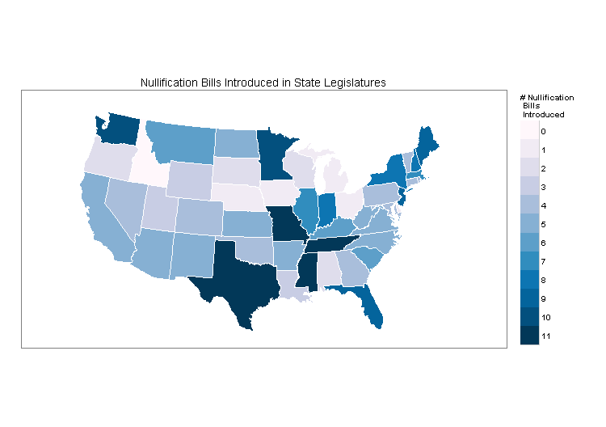
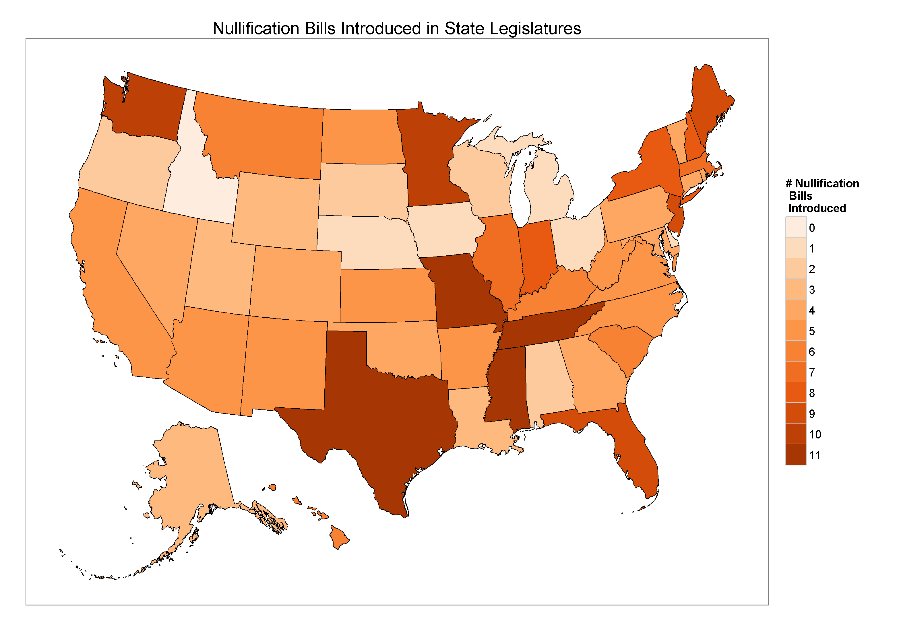

_Feb 2017 edit: It has come to my attention when helping someone else with a map problem that I didn't put in here that you have to add a "district of columbia" observation into your data in the alphabetical order and just put a zero for the variable of interest. If you don't have the DC observation, it won't merge correctly with the coordinates file._

I've been working on a paper about the return of nullification in the states that I am presenting with two other people at APSA next month. One part I am working on is doing an overview of the actual spread of [nullification](https://en.wikipedia.org/wiki/Nullification_(U.S._Constitution)). I thought (and continue to think) that one of the simplest ways to show where the nullification activity is located is to plot how many nullification bills were introduced in each state during this last legislative session. For instance, Texas had ten bills attempting to nullify federal laws introduced during the 2015 legislation session while Ohio, only one. The only problem is that I've never worked with GIS or any other map plotting program.

The way this post will proceed is that I'll go over how to make such a map with the [maps package in R](http://cran.r-project.org/web/packages/maps/index.html) and then I'll go over how to actually read in map "shapefiles" which provides much more extensive flexibility than the maps package. The broader motivation for this is that, outside of the maps package, it seemed kind of difficult / not well documented for how to make maps in R. That said, I relied heavily on [these](http://www.bertplot.com/visualization/?p=429) two [posts](http://www.bertplot.com/visualization/?p=524) from bertplot.com. I don't know who runs the blog, but his posts were by far the best tutorials on how to make maps.

## Maps package in R

The maps package seems to have a bunch of canned maps in the package — which is what makes it easier to work with than loading in the raw shapefiles yourself. Basically the logic for plotting data with a 'maps' map is that you load in the map you want from the package (in my case, a state level map of the United States), load in the data you want to plot, combine the two and make a plot. Some people out there say you don't need to actually merge the two files but I couldn't get that to work — though I didn't spend too long on that particular strategy. The code to do that looks like this:

```r
# Actually making maps
# Load up the Nullification Data and combine it to make graphs
library(ggplot2)
library(maps)
library(plyr)
library("RColorBrewer")

totalstate <- read.csv("AggregateBills.csv", header = TRUE)

# Create States DF
state.coords <- map_data("state")

# Merge State coord and data file.
state.dat <- merge(state.coords,
                    totalstate,
                    by.x = 'region',
                    by.y = 'state',
                    sort = F,
                    all.x = T)   # Keep all coordinate lines

# Make sure our data are in the correct order
state.dat = state.dat[order(state.dat$order), ]

# Plotting # of raw nullification bills introduced
map <- ggplot(state.dat)
map <- map + theme_bw()
map <- map + geom_polygon(aes(x = long, y = lat, group = group, fill = factor(introduced)),
                           colour = "white", lwd = 0.3)
map <- map + coord_map(project = "conic", lat0 = 30)

## Create color scale since this won't work
colors <- brewer.pal(9, 'PuBu')
pal <- colorRampPalette(colors)

## Add colors, a legend, and title
map <- map + scale_fill_manual(name = "# Nullification \n Bills \n Introduced", values = pal(12))
map <- map + guides(fill = guide_legend(override.aes = list(colour = NULL)))
map <- map + labs(title = "Nullification Bills Introduced in State Legislatures")

## Blank axis ticks
map <- map + theme(axis.ticks = element_blank(),
                    axis.text.x = element_blank(),
                    axis.text.y = element_blank(),
                    axis.title.x = element_blank(),
                    axis.title.y = element_blank())
## Hide gridlines
map <- map + theme(panel.grid.minor = element_blank(),
                    panel.grid.major = element_blank())
```

The above code produces the following graph.



Let's break down the code a little.

```r
# Create States DF
state.coords <- map_data("state")

# Merge State coord and data file.
state.dat <- merge(state.coords,
                    totalstate,
                    by.x = 'region',
                    by.y = 'state',
                    sort = F,
                    all.x = T)   # Keep all coordinate lines
```

This section is the most difficult section of using the maps package. We create a dataframe for the state level coordinates and merge it with the `totalstate` df, which is a two column dataframe with states and how many nullification bills that state had during this last session. The state names need to be lowercase. This is extremely important and will be important for the other method as well. If your state names are not lower cased, and the `state` variable lowercased, it won't merge. Here is what the first few lines of the `totalstate` df look like:

| state    | introduced |
| :------- | :--------- |
| alabama  | 2          |
| alaska   | 3          |
| arizona  | 5          |
| arkansas | 5          |

After that it's just a matter of plotting the data. There was a little uniqueness for me with respect to color that I want to spend a minute on. Take a look at this code:

```r
## Create color scale since this won't work
colors <- brewer.pal(9, 'PuBu')
pal <- colorRampPalette(colors)

## Add a color scale, legend, and title
map <- map + scale_fill_manual(name = "# Nullification \n Bills \n Introduced", values = pal(12))
map <- map + guides(fill = guide_legend(override.aes = list(colour = NULL)))
map <- map + labs(title = "Nullification Bills Introduced in State Legislatures")
```

This is where I try to deal with how to scale the state data. The range of data is 0–11 and I want the colors to look sequential — the more nullification bills, the darker a state becomes. RColorBrewer doesn't have sequential palettes that go up to 11 (check [here](http://colorbrewer2.org/) for the list). However, with `brewer.pal` you can create a custom scheme based on one of the RColorBrewer schemes. In this case, I use the full range (9) of the PuBu scheme and extrapolate it to 12 colors.

In any case, the graph looks pretty good. I sent it to one of my coauthors and he responded with "looks good, what about Alaska and Hawaii?" That's when I found out that the `maps` package only contains the mainland U.S., and that I'd probably have to read in my own shapefiles to fix that. Luckily this isn't that much more difficult, but it is a bit harder.

## The harder way: raw shapefiles

The other way to make maps is to read in the raw shapefiles that contain the information for how a map looks. [See this post on Hadley Wickham's GitHub page](https://github.com/hadley/ggplot2/wiki/plotting-polygon-shapefiles) for more on shapefiles generally. In this case, we're again looking at state level data, and the logic is the same — load the shapefiles, load the data, merge, plot. The first step, loading the shapefiles, is the hardest part. You can download the map shapefiles from the [U.S. Census here](https://www.census.gov/geo/maps-data/data/cbf/cbf_state.html).

Here is the code:

```r
library(maptools)
library(mapproj)
library(rgeos)
library(rgdal)
library(RColorBrewer)
library(ggplot2)
library(grid)

# Load SpatialPolygonsDataFrame of US State borders
states50 <- readOGR(dsn = '.', layer = 'cb_2013_us_state_20m')

# Change projection
states50 <- spTransform(states50, CRS("+proj=laea +lat_0=45 +lon_0=-100 +x_0=0 +y_0=0 +a=6370997 +b=6370997 +units=m +no_defs"))
states50@data$id <- rownames(states50@data)

# Rotate, scale, and move Alaska (State ID 02)
alaska <- states50[states50$STATEFP == "02", ]
alaska <- elide(alaska, rotate = -50)
alaska <- elide(alaska, scale = max(apply(bbox(alaska), 1, diff)) / 2.2)
alaska <- elide(alaska, shift = c(-2100000, -2500000))
proj4string(alaska) <- proj4string(states50)

# Rotate and move Hawaii (State ID 15)
hawaii <- states50[states50$STATEFP == "15", ]
hawaii <- elide(hawaii, rotate = -35)
hawaii <- elide(hawaii, shift = c(5400000, -1400000))
proj4string(hawaii) <- proj4string(states50)

# Remove old Alaska/Hawaii and territories, then rebuild
states48 <- states50[!states50$STATEFP %in% c("02", "15", "72", "66", "60", "69", "74", "78", "11"), ]
states.final <- rbind(states48, alaska, hawaii)

# Load my data
AggregateBills <- read.csv("AggregateBills.csv", header = TRUE)

# Merge
states.final@data$state <- tolower(states.final@data$NAME)
states.final@data <- merge(states.final@data,
                            AggregateBills,
                            by = 'state',
                            sort = F,
                            all.x = T)

# Transform shapefile into a data.frame for plotting
states.plotting <- fortify(states.final, region = 'state')

# Merge data with fortified shapefile
state.dat <- merge(states.plotting,
                    AggregateBills,
                    by.x = 'id',
                    by.y = 'state',
                    sort = F,
                    all.x = T)
state.dat <- state.dat[order(state.dat$order), ]

# Set up colors
colors_aggro <- brewer.pal(5, 'Oranges')
pal_aggro <- colorRampPalette(colors_aggro)

# Graph for raw # introduced
aggro <- ggplot(state.dat)
aggro <- aggro + theme_bw()
aggro <- aggro + geom_polygon(aes(x = long, y = lat, group = group, fill = factor(introduced)),
                               colour = "black", lwd = 0.3)
aggro <- aggro + scale_fill_manual(name = "# Nullification \n Bills \n Introduced", values = pal_aggro(12))
aggro <- aggro + guides(fill = guide_legend(override.aes = list(colour = NULL)))
aggro <- aggro + labs(title = "Nullification Bills Introduced in State Legislatures")
aggro <- aggro + theme(axis.ticks = element_blank(),
                        axis.text.x = element_blank(),
                        axis.text.y = element_blank(),
                        axis.title.x = element_blank(),
                        axis.title.y = element_blank())
aggro <- aggro + theme(panel.grid.minor = element_blank(),
                        panel.grid.major = element_blank())
aggro
```

and here is the image it produces:



In this case, I just took the map code from bertplot and let that do all the heavy lifting with respect to adding Hawaii and Alaska down to Mexico. I do want to reiterate how important it is to have the merging variables just so. I spent probably half a day trying to get this to work and couldn't, because I had misspelled Delaware. For real. Never again will I misspell Delaware. If your state names are spelled correctly and the case matches the map dataframe, it should merge easily and just be a matter of making the plot.

Let me know if you have any questions.
