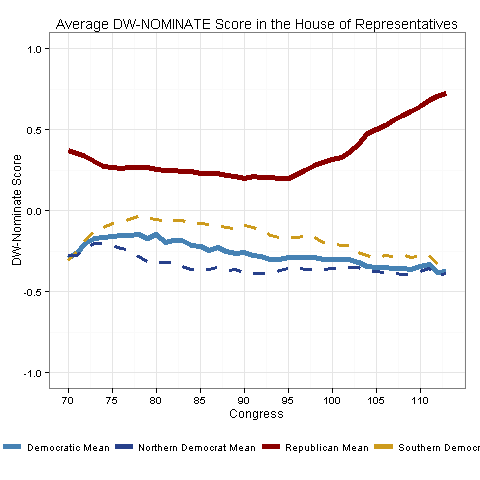

One thing that people who study Congress inevitably need to deal with is plotting the main measure of Congressional ideology, [DW-NOMINATE](http://voteview.com/dwnomin.htm), by Congress and broken down by party. Depending on your needs, you might also need to differentiate between Northern and Southern Democrats in the plot. The scholars who developed DW-NOMINATE have made a pretty good version of this graph for [their own blog](http://voteview.com/political_polarization_2014.htm), but I needed something a little higher quality for published work.

This should be straightforward to do in ggplot, but the three types of Democrats throw off my usual way of doing it. The way ggplot wants someone to make graphs with multiple lines is to make the base graph (in this case, x = Congress and y = average ideology) and then use the color aesthetic to color each line according to an exclusive party variable — party = 1 gets one color, party = 2 gets another, and so on. There might be a way to build this graph that way, but I couldn't figure it out. Wanting to count Democrats for the "Democrats" line and then separately for two other Northern/Southern lines breaks that approach. So in this post I'm going to make this graph in ggplot, but not the easy way.

Before I get started: the base DW-NOMINATE data has ideology scores for every individual member of Congress, ever, but I want to plot the mean Democrat, mean Republican, etc., for each Congress. There are ways to aggregate up to those quantities of interest in ggplot using [stat_summary](http://docs.ggplot2.org/current/stat_summary.html), but since I'm not playing by ggplot's usual color rules, everything that normally makes ggplot easy works against me here. That's not a knock on ggplot, just that it requires a workaround. I used the `reshape2` package to build a dataframe with averages for all my categories of interest — one row per Congress, with columns for the three Democratic groups and the Republicans. My strategy in this graph is to plot each line separately on the same graph. It isn't difficult, but figuring out how to customize the graph and legend took some time.

Here is the graph, and below it, the code. You'll notice that due to the lack of a grouping variable, I had to override the color scale and do some trickery with the legend. I could have put the legend inside the plot (as in the voteview example above), but I like it at the bottom.



```r
## Plotting the party means, with Northern/Southern Democrats broken out
p1gv1ww2 <- ggplot(Agg80, aes(Congress)) +
  geom_line(aes(y = Republican, colour = "Republican Mean"), size = 1.8) +
  geom_line(aes(y = Democratic, colour = "Democratic Mean"), size = 1.8) +
  geom_line(aes(y = SouthernDemocrat, colour = "Southern Democrat Mean"), size = 1.1, linetype = "dashed") +
  geom_line(aes(y = NorthernDemocrat, colour = "Northern Democrat Mean"), size = 1.1, linetype = "dashed")

## Labels
p1gv1ww2 <- p1gv1ww2 + labs(x = "Congress", y = "DW-NOMINATE Score",
                             title = "Average DW-NOMINATE Score in the House of Representatives")

## Scale
p1gv1ww2 <- p1gv1ww2 + ylim(c(-1, 1)) +
  scale_x_continuous(breaks = c(70, 75, 80, 85, 90, 95, 100, 105, 110))

## Partisan color scheme
p1gv1ww2 <- p1gv1ww2 + scale_color_manual(values = c("steelblue", "royalblue4", "darkred", "goldenrod3"))

## Theme
p1gv1ww2 <- p1gv1ww2 + theme_bw()

## Legend
p1gv1ww2 <- p1gv1ww2 + theme(legend.title = element_blank(),
                              legend.position = "bottom",
                              legend.key = element_blank())

dev.copy(png, 'p1gv1ww2.png')
dev.off()
```

As always, let me know if you have any questions.
